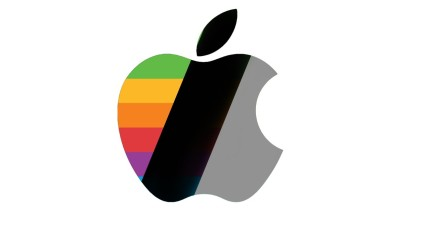

# Manuel Abraham Bringas Alvarado

Los lenguajes de programación que he utilizado son C#, java, HTML.💻  
-En base de datos he utilizado SQL Server.🖥📱  
-[LinkedIn](https://mx.linkedin.com/in/abraham-bringas-945b76264?trk=people-guest_people_search-card)  
-Soy Estudiante del Instituto Tecnologico de Tijuana.  

-
